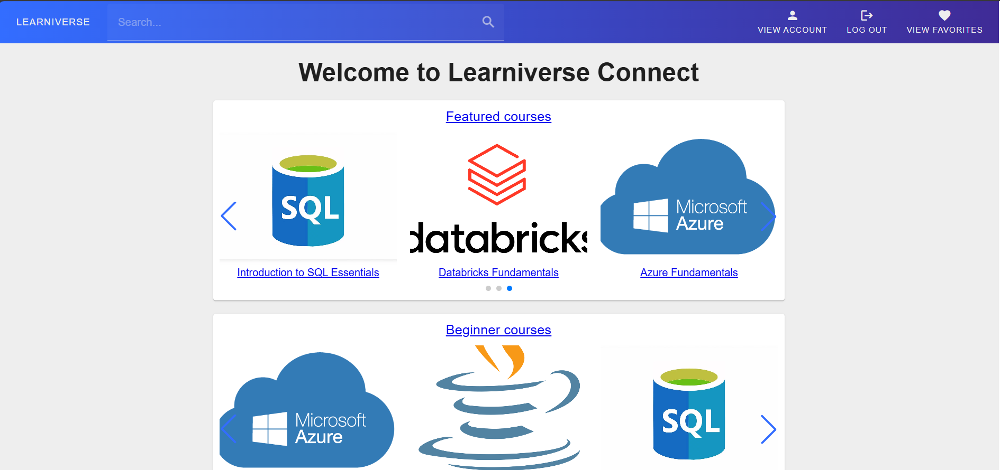
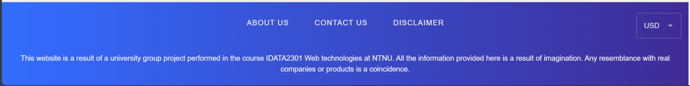
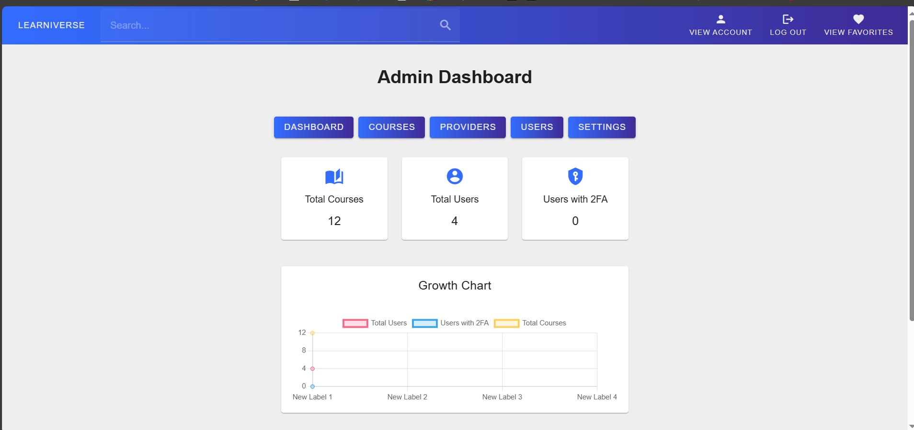
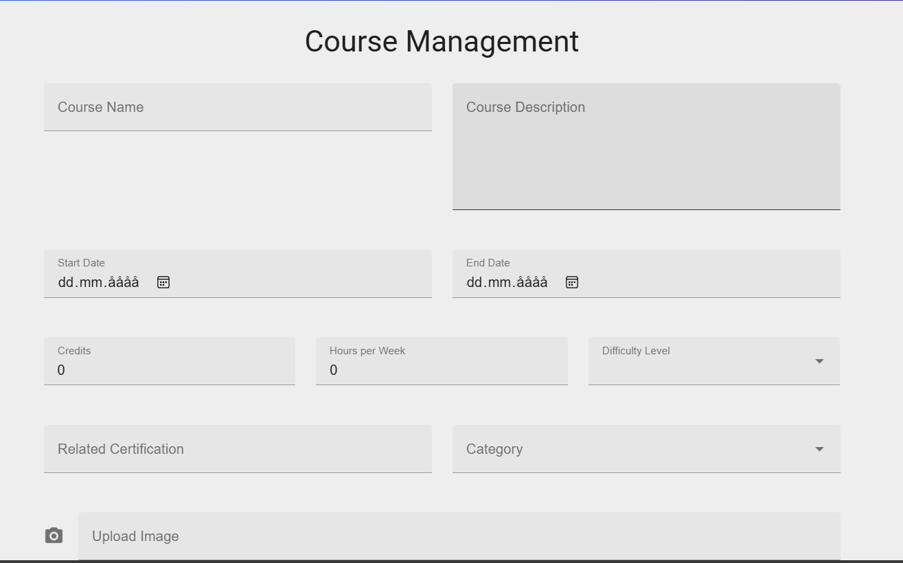
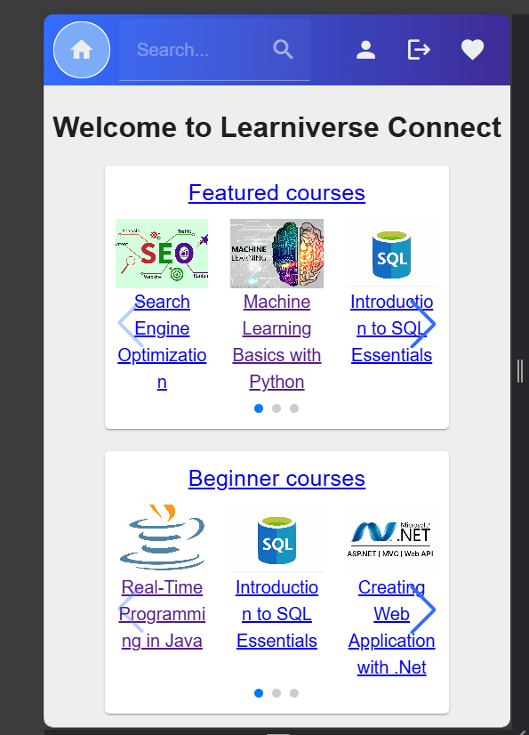
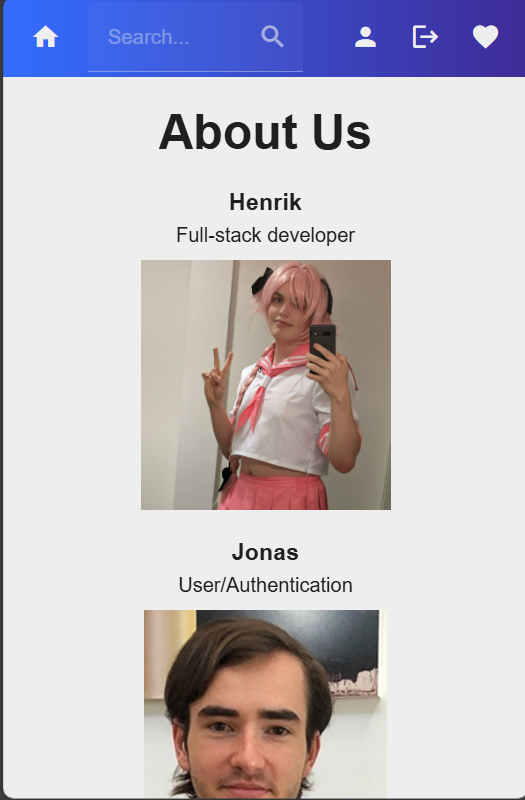
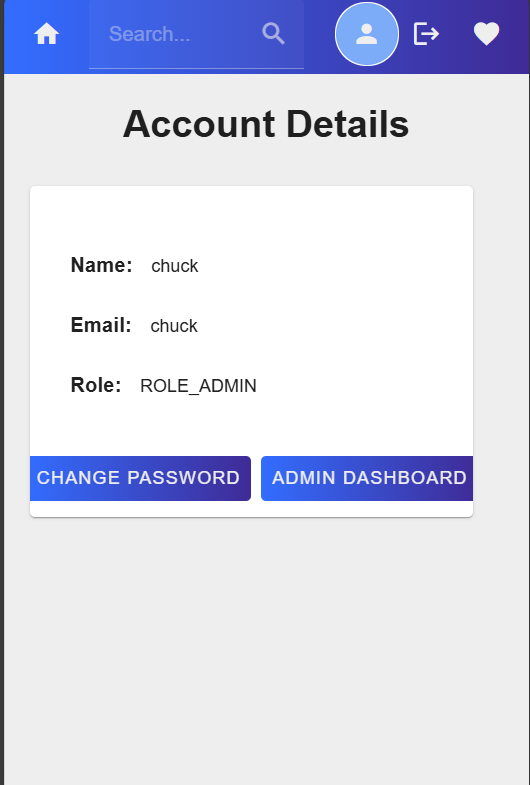
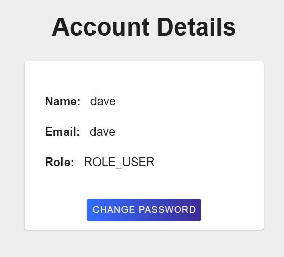
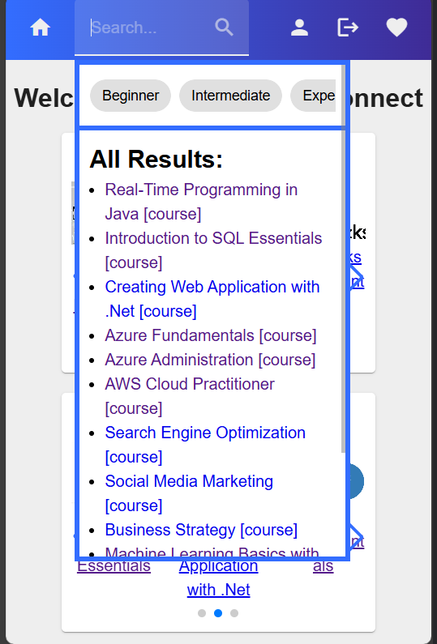

Disclaimer in this project, Chatgpt was used for help for ideas on how to solve things though code was never purely used copy-pasted as is,
but some code is adapted from it,
and Github Copilot was used to auto-finish documentation based on previously written documentation by the human.

# Instructions for running the backend application
The backend part can be found via a directory named "backend".
1. An environmental file called "application.properties" is required to run CourseApplication (SpringApplication run class).
   It should be placed in the "resources" folder. MySQL needs to be installed and set up on the computer being used to run the backend application.
   The required information for application.properties:
2. spring.datasource.driver-class-name=com.mysql.cj.jdbc.Driver
3. spring.datasource.username=username
    
Note, after username=, you need to replace username with your own MySQL username.

4. spring.datasource.password=password
    
Note, after password=, you need to replace password with your own MySQL password.

5. spring.jpa.generate-ddl=true
6. spring.datasource.url=jdbc:mysql://localhost:3306/DatabaseName
     
Note, you need to replace the port 3306 (or keep) and DatabaseName
       to match your own localhost port and the name of your database. 

7. spring.jpa.hibernate.ddl-auto=update
8. exchange-rates.api-key=fca_live_dRut7mcwQz60d4Om7n1ei550LoECjIgmr6UIoJHY
   
The exchange rate's api is not a security concern, so we will just place it here. This token will be deleted after project examination is complete. 

9. server.port=8080
   
Replace or keep the 8080 port with the localhost port you wish to use.

10. jwt_secret_key=PasteInWhatYouGetFromBelow
    
Use this website to generate a JWT key to use: https://jwt.io/#debugger ./p>

# Instructions for running the frontend application
#### 
node.js v21.x needs to be installed (and set up as environmental path variable).

##### From the root of the project folder, find the directory named "frontend" and open it via integrated terminal in VSC, or "open in terminal" for IntelliJ. Alternatively, pure command line can be used to find the directory. From the frontend directory, run the following node.js commands:
1. npm install
2. npm install axios
3. npm install swiper
##### To run the frontend, in the "frontend" directory, run the command "npm run dev". In this project, "http://localhost:3000/" is used to run the frontend locally. This comes from vite.config.js, you can alter the port there from 3000 if you wish.

#### Home page on laptop:

#### Footer:

#### Admin Dashboard:

#### Admin Add Course, NB NOT MOBILE COMPLIANT!

#### Home Page on mobile:

#### About us on mobile, scrollable, vertical:

#### Admin Account Details:

#### Non-Admin Account Details:

#### Search bar on mobile:

